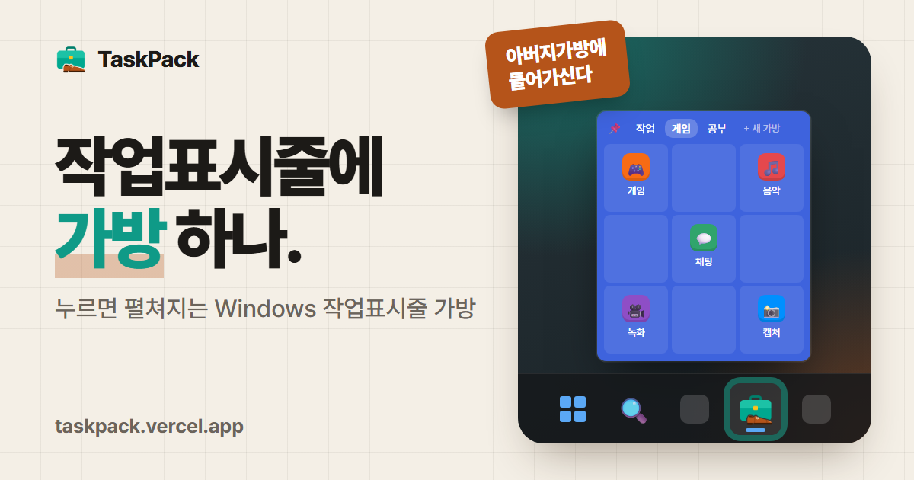

<p align="center">
  
</p>

<h1 align="center">TaskPack</h1>

<p align="center">
  <b>작업표시줄에 가방 하나.</b><br>
  누르면 펼쳐지는 Windows 작업표시줄 가방 · <i>아버지가방에들어가신다</i>
</p>

<p align="center">
  <a href="https://github.com/pomeloEater/TaskPack/releases/latest"></a>
  <a href="https://github.com/pomeloEater/TaskPack/releases"></a>
  
  
  <a href="LICENSE"></a>
</p>

<p align="center">
  <a href="https://taskpack.vercel.app"><b>🏠 홈페이지</b></a> &nbsp;·&nbsp;
  <a href="https://github.com/pomeloEater/TaskPack/releases/latest"><b>⬇️ 내려받기</b></a> &nbsp;·&nbsp;
  <a href="#3-사용법"><b>🎒 사용법</b></a> &nbsp;·&nbsp;
  <a href="spec/plan.md"><b>📐 설계 문서</b></a>
</p>

<p align="center">
  
</p>

작업표시줄의 가방 아이콘을 누르면 **마비노기 가방처럼 칸이 있는 창**이 작업표시줄 옆에 펼쳐지고, 칸을 한 번 누르면 프로그램이 실행됩니다. 가방은 탭으로 여러 개 만들 수 있어요. 바탕화면과 작업표시줄은 비우고, 자주 쓰는 프로그램은 가방에서 꺼내 쓰세요.

## 특징

| 🗂️ 탭으로 여러 가방 | 🖱️ 끌어서 넣기 | 🎨 가방마다 다른 색 | 📍 작업표시줄 옆에 착 | 💾 zip 하나로 백업 |
|---|---|---|---|---|
| 작업용·게임용·공부용, 이름과 순서도 자유롭게 | 파일·폴더·바로가기·Windows 앱. 작업표시줄 앱은 체크만 | 시스템·라이트·다크·커스텀 색 | 가로 작업표시줄은 위로, 세로는 옆으로 | 새 PC에서도 가방 그대로 |

처음 쓰는 분을 위한 기능도 있습니다. 빈 가방에는 **작업표시줄 앱 가져오기**와 **파일로 넣기** 버튼이 있고, 작업표시줄에 고정되어 있지 않으면 고정하라고 알려 줍니다. 탭 아이콘은 컬러 이모티콘 68개 중에서 고를 수 있으며, 새 버전이 나오면 가방 아래에서 알려 줍니다.

Windows 11에서는 작업표시줄 아이콘에 **마우스를 올리기만 해도 가방이 열리게** 할 수 있습니다(기본은 꺼짐, 설정에서 켭니다). 켜면 TaskPack이 뒤에서 계속 켜져 있다는 점이 달라지니 아래 "마우스를 올려서 열기"를 읽어 보세요.

## 1. 설치

[릴리스 페이지](https://github.com/pomeloEater/TaskPack/releases/latest)에서 설치 파일을 받아 실행합니다. 두 가지가 있습니다.

| 파일 | 크기 | 이럴 때 |
|---|---|---|
| `TaskPack-Setup-<버전>.exe` (기본) | 약 51MB | **처음이라면 이쪽.** .NET이 들어 있어 따로 설치할 것이 없습니다. ARM PC도 이쪽을 쓰세요 (x64 에뮬레이션으로 실행). |
| `TaskPack-Setup-<버전>-lite.exe` | 약 5MB | PC에 **.NET 10 데스크톱 런타임(x64)**이 이미 있을 때. 없으면 설치 프로그램이 알려 줍니다. |

- 두 파일은 같은 프로그램입니다. 어느 쪽을 깔아도 서로 덮어 설치되고(업그레이드로 취급), 가방 데이터는 그대로 남습니다.
- lite에서 .NET 10 데스크톱 런타임이 없다고 나오면:
  - 바로 받기: [Microsoft 공식 설치 파일 (Windows x64, 약 60MB)](https://aka.ms/dotnet/10.0/windowsdesktop-runtime-win-x64.exe) — 항상 10.0 최신판으로 연결됩니다.
  - 또는 [다운로드 페이지](https://dotnet.microsoft.com/download/dotnet/10.0)에서 **.NET 데스크톱 런타임 10.0.x**(.NET Desktop Runtime) 항목의 Windows **설치 관리자 x64**를 받으세요. SDK, ASP.NET Core 런타임, 그냥 .NET 런타임이 아닙니다.
- 기본은 관리자 권한 없이 내 계정에만 설치합니다(`%LOCALAPPDATA%\Programs\TaskPack`). 시작할 때 "모든 사용자용"을 고를 수도 있습니다.
- 선택 항목: 설치 경로, 바탕화면 아이콘, 설치 후 실행
- 제거는 Windows 설정 → 앱에서 합니다. 제거할 때 가방 데이터도 지울지 묻습니다(기본: 보관).

## 2. 작업표시줄에 가방 고정하기

Windows가 프로그램의 자동 고정을 막고 있어서 한 번은 직접 고정해야 합니다.

- 시작 메뉴에서 **TaskPack**을 우클릭 → **작업 표시줄에 고정**
- 또는 가방 오른쪽 위 ⚙ → 기본 설정 → **작업표시줄에 고정하기…**를 누르면 바로가기 위치를 탐색기로 열어 줍니다.

## 3. 사용법

```
[📌] [🎮 게임] [아버지가방] [개발도구] [+ 새 가방] ········ [⚙]
```

| 하고 싶은 일 | 방법 |
|---|---|
| 프로그램 실행 | 칸을 한 번 클릭 (실행 후 가방이 닫힘) |
| 가방 닫기 | 바깥 클릭 / `Esc` / 작업표시줄 아이콘 다시 클릭 |
| 가방(탭) 바꾸기 | 탭 클릭 |
| 가방 추가 | **+ 새 가방** → 바로 이름 입력 |
| 가방 이름 바꾸기·지우기 | 탭 더블클릭 → 이름 고치고 `Enter` (또는 다른 탭 클릭), ✕로 삭제 |
| 처음 시작하기 | 빈 가방 가운데의 **작업표시줄 앱 가져오기** / **파일로 넣기** 버튼. 가방 아래의 "작업표시줄에 고정하면 한 번에 열려요" 띠에서 **고정하기**를 누르면 고정 방법을 안내합니다 (×로 다시 보지 않기). |
| 파일 넣기 | 빈칸(또는 빈 곳) 우클릭 → **파일로 넣기…** → exe·바로가기·아무 파일이나 여러 개 고르기. 또는 📌을 켠 뒤 탐색기·바탕화면에서 원하는 칸에 끌어다 놓기 |
| 작업표시줄에 고정된 앱 넣기·빼기 | 빈 곳 우클릭 → **작업표시줄 앱 가져오기…** → 이미 든 앱은 체크되어 있음. 새로 체크하면 넣고, 체크를 풀면 뺌 |
| 시작 메뉴 앱(스토어 앱 포함) 넣기 | 빈 곳 우클릭 → **Windows 앱 목록 열기** → 앱을 가방으로 끌기 |
| 자리 옮기기 | 칸을 다른 칸으로 끌기 (찬 칸이면 서로 자리 바꿈) |
| 다른 가방으로 옮기기 | 칸을 다른 탭 위로 끌어 놓기 (그 가방의 첫 빈칸으로) |
| 탭 순서 바꾸기 | 탭을 다른 탭 위로 끌어 놓기 |
| 가방 창 옮기기 | 탭 줄의 빈 곳을 잡고 끌기 (다음에 열면 다시 작업표시줄 옆) |
| 아이템 빼기 | 칸 우클릭 → 빼기 |

- 키보드로도 쓸 수 있습니다. **Tab / Shift+Tab**은 아이템이 있는 칸끼리, **방향키**는 격자를 따라 옮기고, **Enter** 또는 **Space**로 실행하며 **Esc**로 닫습니다. 마우스를 올려서 연 가방은 입력을 가로채지 않으므로, 안을 한 번 누른 뒤부터 키보드가 동작합니다.
- 📌(고정)을 켜면 바깥을 눌러도 가방이 닫히지 않습니다. 파일을 끌어 넣을 때 켜 두세요.
- 작업표시줄 아이콘은 Windows가 밖으로 끌어내는 것을 막아서 직접 끌어 넣을 수 없습니다. 그래서 "가져오기"를 씁니다.
- 파일은 복사하지 않고 경로만 기억합니다. 원본을 지우거나 옮기면 칸이 흐리게 보입니다. 가져온 작업표시줄 앱은 가방 폴더에 바로가기를 복사해 둡니다.
- 지운 가방은 `%APPDATA%\TaskPack\deleted`에 보관됩니다.

## 4. ⚙ 설정

| 항목 | 내용 |
|---|---|
| 전체 테마 | 시스템 설정 따라가기 / 라이트 / 다크 |
| 가방별 테마 | 전체 설정 / 시스템 / 라이트 / 다크 / 커스텀. 커스텀은 색 버튼으로 추천 12색 또는 원하는 색을 고릅니다. 글자색은 배경 밝기에 맞춰 자동으로 정해집니다. |
| 가방별 크기 | 가로·세로 각각 1부터 12칸까지. 줄이면 밖으로 나가는 아이템은 빈칸으로 옮깁니다. 아이템보다 칸이 적어지면 줄이지 않습니다. |
| 탭 아이콘 | **컬러 이모티콘 68개** 중에서 고르기. 목록에 없는 이모티콘은 직접 입력(Win + .)할 수 있고, 이때는 컬러 글꼴을 그릴 수 없어 탭 글자색 한 가지로 보입니다. 그림 파일(`.ico` `.png` `.jpg` `.bmp` `.exe` `.dll`)도 고를 수 있고, 이모티콘과 그림 파일은 둘 중 하나만 씁니다. |
| 이름 숨기기 | 탭 아이콘(이모티콘 포함)이 있을 때 탭에 아이콘만 보이게 합니다. |
| 작업표시줄 아이콘 | 바꾸기, 기본 아이콘으로 되돌리기. 바로 안 바뀌면 고정을 풀었다가 다시 고정하세요. |
| 마우스를 올리면 열기 | 작업표시줄 아이콘에 마우스를 올리면 가방 열기(기본 꺼짐), 머무는 시간(0.2~1초), Windows를 시작할 때 TaskPack 켜 두기 스위치. 자세한 내용은 아래 "마우스를 올려서 열기". |
| 버전 | 현재 버전, 최신 버전, **지금 확인**, **새 버전 자동 확인** 스위치(기본 켜짐). 켜 두면 가방을 열 때 하루에 한 번 GitHub 공개 주소에서 최신 버전 번호만 읽어 옵니다. **보내는 정보는 없고**, 새 버전이 있으면 가방 아래에 알려 줍니다. 받기를 누르면 지금 쓰는 것과 같은 판(기본/lite)의 설치 파일을 내려받습니다. |
| 백업 | 모든 가방을 zip으로 내보내기·불러오기. 불러오기 전 상태는 `restore-backup-<시각>` 폴더에 보관됩니다. |

### 마우스를 올려서 열기

설정 → 기본 설정 → **마우스를 올리면 열기**를 켜면, 작업표시줄의 TaskPack 아이콘 위에 마우스를 잠깐(기본 0.4초) 올려 두는 것만으로 가방이 열립니다. 머무는 시간은 같은 카드에서 0.2초 / 0.4초 / 0.7초 / 1초 중에서 고를 수 있습니다(너무 짧으면 지나가다 스칠 때도 열릴 수 있습니다). 클릭으로 여는 방법은 그대로 쓸 수 있습니다. 업데이트 뒤 처음 가방을 열면 가방 아래에서 이 기능을 소개하며, 거기서 바로 켤 수도 있습니다.

- **켜면 달라지는 점**: 마우스를 올렸는지 지켜보려고 TaskPack이 뒤에서 계속 켜져 있습니다(작업 관리자 기준 메모리 약 10MB). 시계 옆(숨겨진 아이콘 칸)에 TaskPack 아이콘이 생기고, Windows를 시작할 때도 자동으로 켜집니다. **끄면 지금까지와 똑같이** 가방을 닫을 때 프로그램도 끝납니다.
- **올려서 연 가방은** 키보드 입력을 가로채지 않습니다. 글을 쓰다가 마우스가 아이콘 위를 지나가도 입력은 쓰던 곳으로 갑니다. 마우스가 가방과 아이콘 밖으로 나가고 0.5초가 지나면 닫힙니다. 가방 안을 한 번 누르거나 아이콘을 누르면 일반 가방이 됩니다. 📌을 켜 두면 닫히지 않습니다.
- **끄는 방법**: 설정에서 스위치를 끄거나, 시계 옆 TaskPack 아이콘 → **마우스오버 끄기**. Windows를 시작할 때 켜는 것만 끄려면 설정의 두 번째 스위치(또는 작업 관리자의 "시작 앱")를 쓰세요. TaskPack을 지우면 자동 실행 항목도 함께 지워집니다.
- **개인정보**: 마우스 위치는 "TaskPack 아이콘 위인가"를 판단하는 데만 쓰고 저장하거나 보내지 않습니다. 마우스 움직임을 가로채는 방식(후킹)도 쓰지 않고, 0.05초마다 위치만 확인합니다.
- **제한**: Windows 11의 기본 작업표시줄에서 동작합니다. 작업표시줄에 TaskPack을 고정해 두어야 하고, Windows 10이나 작업표시줄을 바꾸는 프로그램에서는 설정에 "지원하지 않습니다"가 표시됩니다.

## 5. 저장 위치

```
%APPDATA%\TaskPack\
  config.json                탭 순서, 마지막 탭, 작업표시줄 아이콘, 안내·새 버전 확인 설정
  bags\<가방 id>\bag.json     가방 이름, 크기, 탭 아이콘(그림 또는 이모티콘), 칸 내용
  bags\<가방 id>\items\      가져온 작업표시줄 앱 바로가기
```

## 6. 개발자용: 빌드와 설치 파일 만들기

필요한 것: .NET 10 SDK, 설치 파일을 만들 때는 Inno Setup 6 (`winget install JRSoftware.InnoSetup`)

| 하고 싶은 일 | 명령 |
|---|---|
| 내 PC에 바로 설치(덮어쓰기) | `powershell -ExecutionPolicy Bypass -File .\publish.ps1` |
| 배포용 설치 파일 만들기 | `powershell -ExecutionPolicy Bypass -File .\build-installer.ps1` → `installer\Output\TaskPack-Setup-<버전>.exe`(.NET 포함)와 `TaskPack-Setup-<버전>-lite.exe` |
| 시험 실행 | `dotnet test tests\TaskPack.Tests` |

버전은 `TaskPack.csproj`의 `<Version>`을 고치면 설치 파일 이름과 정보에 함께 반영됩니다. 두 판은 `SelfContained` 여부로 갈리고, 프로그램은 빌드 때 들어간 `Edition`(full/lite) 값으로 자기 판을 알아 새 버전 알림이 같은 판의 파일을 가리킵니다. 릴리스에 올리는 파일 이름은 이 규칙(`-lite` 접미사)을 지켜야 홈페이지와 새 버전 알림이 두 파일을 구분합니다.

개발 중에 앱을 띄워 볼 때는 환경변수 `TASKPACK_DATA_DIR`에 임시 폴더를 지정하면 실제 가방 데이터(`%APPDATA%\TaskPack`) 대신 그 폴더를 씁니다.

## 7. 라이선스

- **TaskPack**: [MIT License](LICENSE). 누구나 자유롭게 쓰고 고치고 배포할 수 있습니다. 저작권 표시와 라이선스 문구만 남겨 주세요.
- **Pretendard 글꼴**: MIT가 아니라 [SIL 오픈 폰트 라이선스 1.1](assets/fonts/OFL.txt)을 따르는 별도 저작물입니다. 글꼴 파일은 프로그램 안에 들어 있습니다.
- **탭 이모티콘 그림**: Microsoft의 [Fluent Emoji](https://github.com/microsoft/fluentui-emoji)(3D 스타일)에서 골라 48px로 줄인 것이며 [MIT License](assets/emoji/LICENSE)를 따릅니다. 그림은 프로그램 안에 들어 있습니다.
- 설치 폴더의 `licenses\`에 위 라이선스 전문이 함께 들어갑니다.

## 8. 앱 아이콘

`assets\TaskPack.ico`는 `tools\make-icon.ps1`로 그린 것입니다(서류가방 + 남자 구두). 모양이나 색을 바꾸려면 스크립트를 고친 뒤 다시 실행합니다.

```powershell
powershell -STA -ExecutionPolicy Bypass -File .\tools\make-icon.ps1 -Preview
```

## 9. 알려진 제한

- Windows가 프로그램의 자동 고정을 막기 때문에 작업표시줄 고정은 직접 해야 합니다.
- 마우스를 올려서 열기는 Windows 11 기본 작업표시줄에서만 동작합니다. 켜면 TaskPack이 뒤에서 계속 켜져 있습니다.
- Windows 11 기본 작업표시줄은 아래쪽만 지원합니다. 세로 작업표시줄(StartAllBack 등)이면 가방이 옆으로 펼쳐집니다.
- lite 버전은 .NET 10 데스크톱 런타임(x64)이 있어야 합니다. ARM PC는 기본 설치 파일을 쓰세요.
- 관리자 권한이 필요한 프로그램은 실행할 때 권한 확인 창이 뜹니다.
